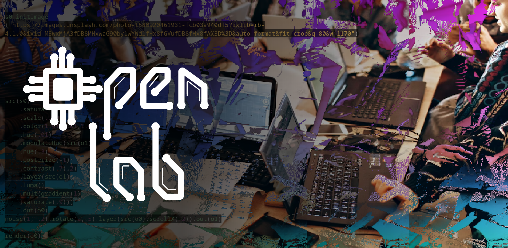

# OpenLab

OpenLab UNED Madrid Sur (Móstoles) es una iniciativa abierta de colaboración y aprendizaje práctico en tecnología. El objetivo es fomentar el trabajo en equipo, la curiosidad y la participación de estudiantes en proyectos tecnológicos de carácter libre, creativo y formativo.

[extension.uned.es/actividad/OpenLab](https://extension.uned.es/actividad/idactividad/47781)
